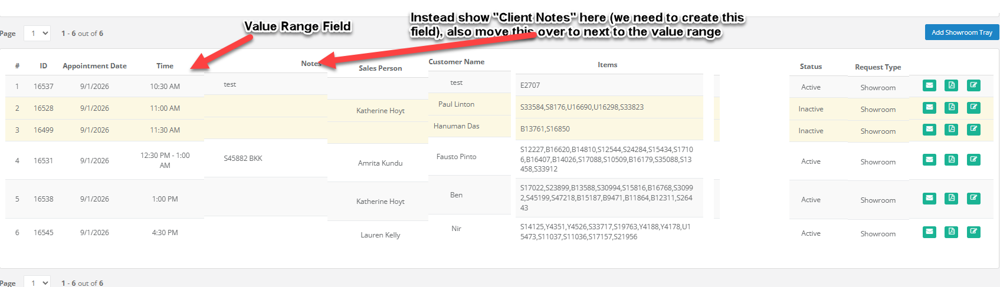

# Features to Consider (and Lauren Input)

- Assigning Desks (Allows for determination based on potential value or stone type) - Able to assign particular appointments to particular desks in the showroom 
  - **Lauren Input:** Instead of having showroom desk assignments what would be more helpful would be a value Scale for the tray that is associated with each appointment. This will give real time info for the Front Desk attendant to allow them to determine the best desk.
  

- Memo Connection - Ability to directly associate Memos w/ Showroom Appointments and use Showroom trays to direct 
  - **Lauren Input:** Supposedly there was some discussion with Praveen about this being in development, I'm wondering where this may be.

- Direct Google Calendar integration (Katherine says Nah , I think there could be some utility if it is perfectly mirrored)
  - **Lauren Import:** If we can get MSX to auto add the appt to the google calendar I think that would be nice. However frequently you add the appt in google BEFORE creating the calendar and also when someone requests an appt, it automatically adds to the showroom tray section before we approve it, we would not want that to sync, maybe it is better not to do this. Actually it might still be useful, if we can create one more status for an appt in MSX- currently we have active and inactive, if the unapproved appts can instead be added as "pending" status we could sync the calendar only for active appts. We could mark it if we don't want it synced as it is already there. 

- **Lauren Input:** One thing that could be helpful in terms of front desk helping prep trays, is if we had a checkmark in the tray "Request to Prepare" and if that is checked it gives an indicator on the main showroom view for the day- so she could easily see which she is needing to put together. 

