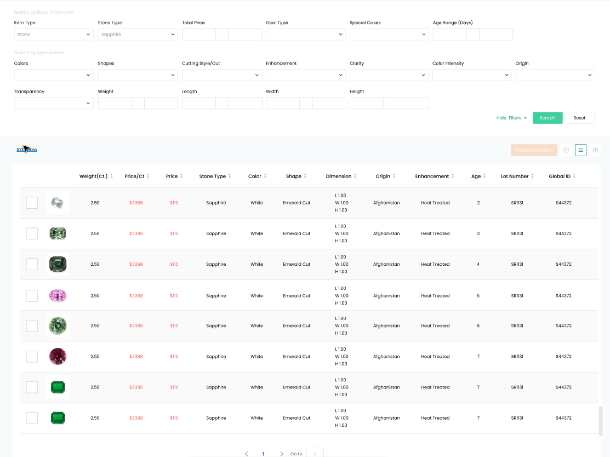
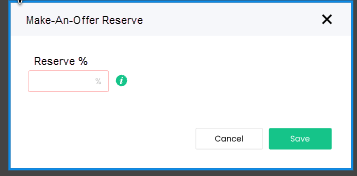

1. From the Promotion Center selecting "Make-An-Offer" will open a list of "Make-An-Offer" Switches; This will be an area where you can select multiple items to add to a "Switch" that will turn "Make-An-Offer" on for an item and push a "Reserve %" to all the items in that list:

2. When the "Add" symbol is selected the same list selection screen for promotions will appear *Note; the button should say "Create Switch" instead of "Create Promotion":

3. After items are selected a pop up should appear that allows you to select the reserve percent for that switch.

