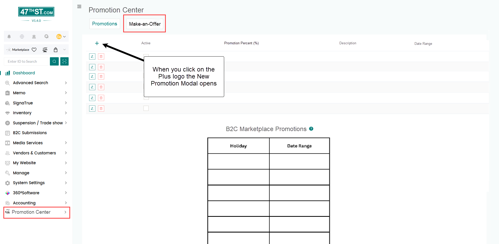
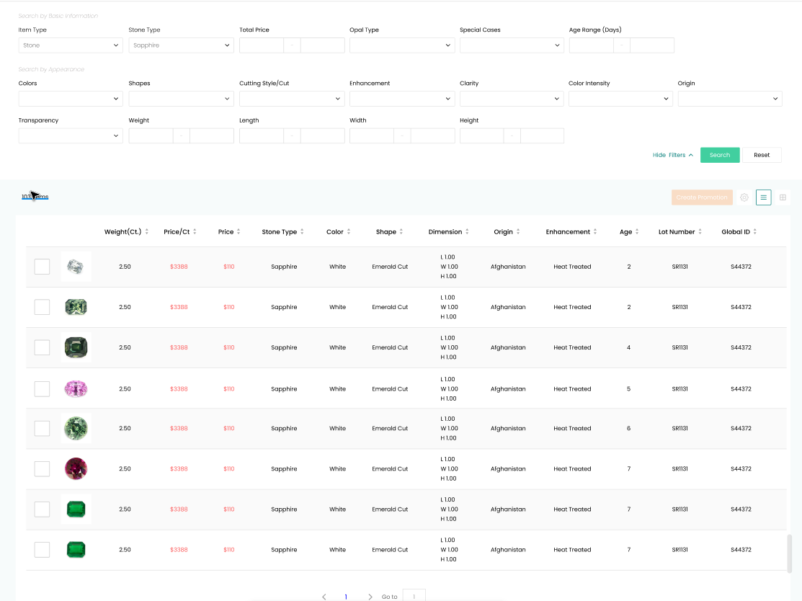
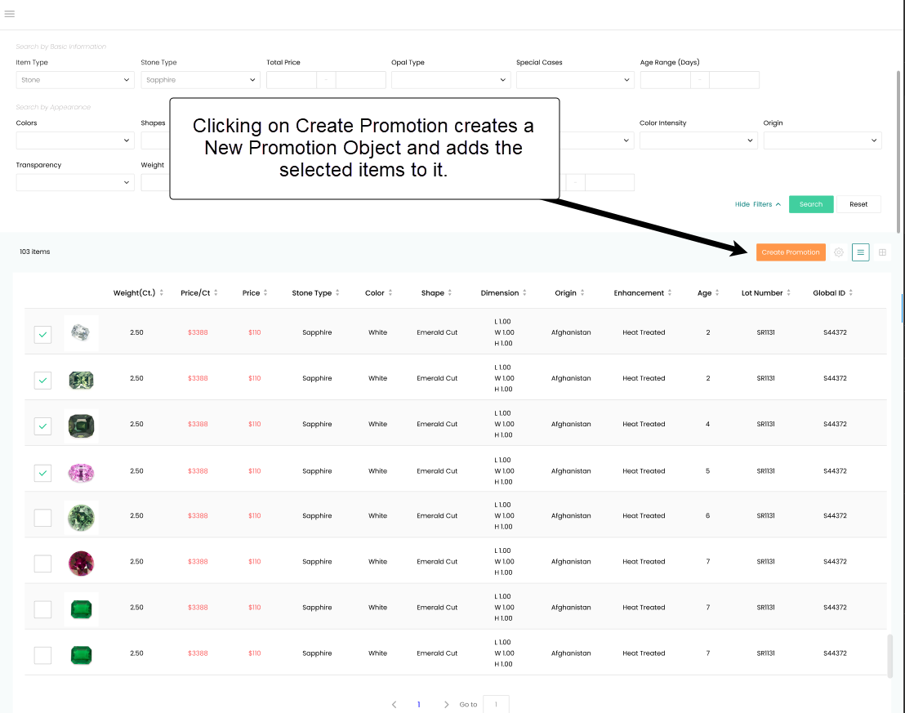
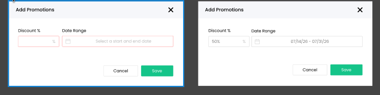
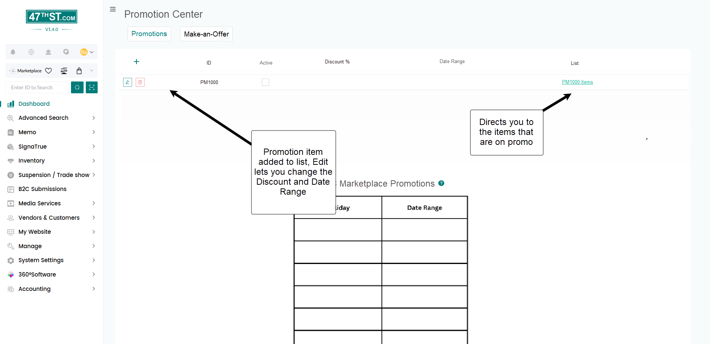
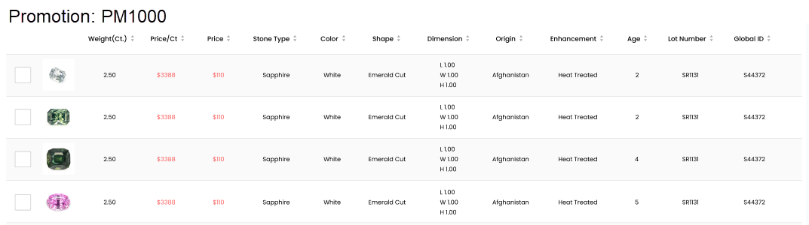

For Promotions and Make an offer there should be a new section on the left hand menu:

1. Promotion Center in the Left Menu
   

Promotions should be Objects that have a list of items that are linked to them. When you select Promotion Center a list of Active and Inactive Promotions should open. There should be 2 tabs at the top that allows you to check between "Promotions" and "Make-An-Offer":

1. Promotion List and Section

When you select the Plus Icon you should be able to search through your inventory and select which items you want to Add to Newly Created Promotion item:

3. New Promotion

After that the pop-up for the Discount % and Date Range appears and can be entered:

4. Promotion details Setting

Once that is selected the item should show in the Promotion Center page:

5. New Item In List

If you click on the List link the list of the items that are on that promo should appear and allow you to remove items. 

6. List of Promo Items
