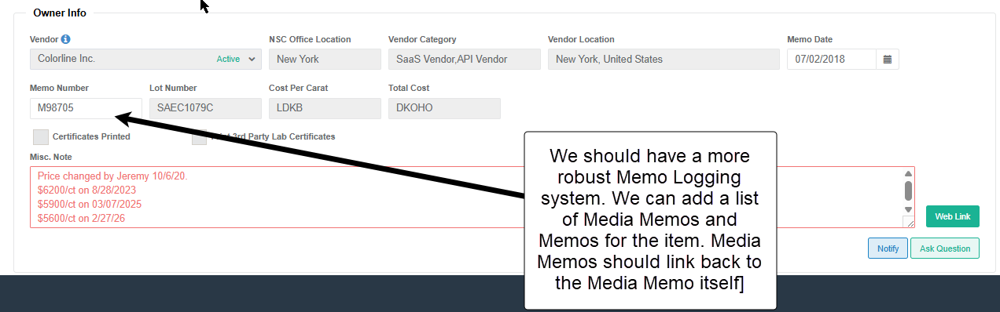

# Media Memo and Progress Screen Breakdown

## Summary

There is a need for a new category of Object to be added to MSX for tracking of progress on Media Memos for better visibility and internal analysis. Additioinally using this approach will allow for better centralization and clarity. Additionally as items are being updated directly in MSX with media,  the person who filmed it, and the date it was recorded this will allow for better tracking of items that have been done for better accuracy of analysis.

## Media Memo Object

Simlar to a Memo object this should be a means of collecting items that will have Media Services done on them. These items should be existing items that have Global IDs created and you can add those items in a similar fashion to how we do Receive and Return items. 

Additionally we can have an interface in 47th Management that allows for collecting of items owned by SaaS vendors that have been approved for media to be sent. We can **connect** the Memo that a vendor creates in 47th/IG directly to MSX and add the items on that memo to a **Media Memo Object**

<u>**2 Ways of generating Media Memos**</u>

```
1. Manually

Items get selected from a list like receive or return and get added to a Media Memo Object. Items can be added manually after the fact as well.

2. Automatically

Memo is generated from Pending Memo in 47th St. That memo is linked with a newly created Media Memo and populates it in MSX accordingly. Other items from Pending Memo can be added and should update in MSX additionally.
```
### Media Memo Object Properties

- Media Memo ID (Media Memo Number)
- Vendor Memo Number
- Vendor
- NXC Office (Could be tied to Vendor)
- Submission Date
- Due Date (Genrated from Submission Date)
- [Item List] (Contains the items that make up the list)
- [Progress] (Filled by the status of media on the items themselves)
- Operation Status (when all media is done status changes to Complete)
- Location Status (keeps track of Received or Returned)
- Paperwork (lets us keep track of the Memo that gets added)


## Media Memos Search / Progress Screen


Shaojuan has already created an Excellent UI, I have requested a couple of additions

1. Ability to filter by NXC office
2. Ability to Search by Item Global ID and Item Lot Number
3. Should have the ability to filter by Received or Returned 

Other than that this screen is for monitoring the progress of existing Media Memos. 

Having the ability to filter between Received and Returned will allow us to see what memos are currently in-house and what memos have been sent back in the system.

Additionally Collating this data will make it easier to gain insights on what current the current load is for the media team and what kind of lattitude we have. Many other insights can be gained as well.

## Media Memo Detail Page


We have a pretty great UI made by Shaojuan here as well and this detail page allows for an exploded out view of the Media Memo with the status of all the individual items for each of their processes.

I requested one addition on the Figma:

1. On Hover over the Process Status it should show who did the process and when they did it.

*Note: This system can also be used for audit and bulk publishing*

The detail page should give all the information on the Media memo and can also act as a place that stores the Memo paperwork (useful for checking back on the intake of stones)

## Items

Items should have a list of the Media memos they were a part of; this allows for not just good monitoring of the items status and memo status but also allows us to walk back directly through the memo and pricing history of items.



## Media Services Dashboard

Idea for a Dashboard with views showing a few different insights on the status of individual memos and overall Media Services per NXC office. 

